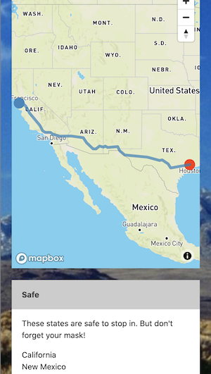

# COVID Road Trip

## Deployed

[Access the deployed web application here.](https://christinakerr.github.io/COVIDRoadTrip/)

## User Story

```
AS A long-distance road tripper,
I WANT to avoid stopping in coronavirus hotspots,
SO THAT I reduce my risk of contracting COVID-19.
```

## Description

With this mobile-first application, the user can tap on the start and end points of their road trip, and the app provides them with lists of states they'll pass through with low, moderate, and high COVID-19 rates. With this information, the user can make informed decisions about where to stop during the duration of their trip.

The user is also invited to save their road trip entertainment ideas for later with COVID Road Trip's Entertainment Profile. Notes made on this page are saved in the browser's local storage.

## Instructions for Use

1. Tap or click the city in which you're beginning your road trip on the map.
2. Then tap or click your destination city.
3. Scroll down and select "Safe," "Moderate" or "Danger!" to view the states you'll pass through that fall into each of those categories.

## Tech

This application leverages:

* HTML
* CSS
* Materialize
* JavaScript
* jQuery
* Mapbox Directions API
* Google Maps Geocoding API
* Novel CoVID19 API



## Collaborators

* [Caroline Miller](https://github.com/caroline-e-miller)
* [Christina Kerr](https://github.com/christinakerr)
* [Emmanuel Stephen](https://github.com/Manii-dot)
* [Prem Gelivi](https://github.com/geliviprem)